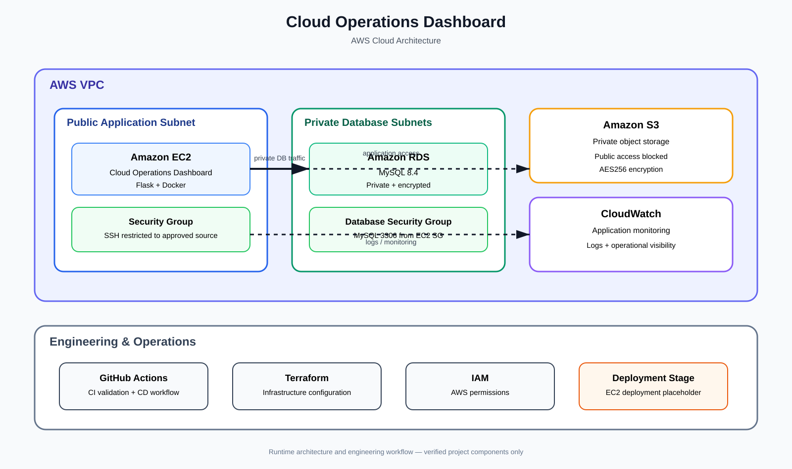

# Cloud Operations Dashboard

## Project Overview

The Cloud Operations Dashboard is an AWS-based cloud engineering capstone designed to demonstrate the design, deployment, automation, containerization, and operation of a small cloud application.

## Technology Stack

- AWS: VPC, EC2, RDS MySQL, S3, CloudWatch, IAM
- Python: Flask application and Boto3 automation
- Terraform: Infrastructure as Code
- Docker: Application containerization
- GitHub Actions: CI/CD workflow

## Project Highlights

- Designed and documented an AWS cloud architecture using VPC networking, EC2, RDS MySQL, S3, IAM, and CloudWatch.
- Built a Python Flask application backed by a private MySQL database.
- Containerized the application with Docker.
- Managed infrastructure configuration with Terraform.
- Implemented Python/Boto3 automation for AWS resource operations.
- Built GitHub Actions CI/CD workflows for validation and Docker image builds.
- Documented security, monitoring, troubleshooting, failure recovery, and operational validation.

## Architecture

The application is designed to run inside a dedicated AWS VPC.

### Current Infrastructure

- AWS VPC
- Public application subnet
- Private database subnets across two Availability Zones
- Internet Gateway
- Public and private route tables
- EC2 compute infrastructure
- Security groups for network access control

### Compute

The application compute layer uses an Amazon Linux 2023 EC2 instance running in the public application subnet.

The EC2 instance provides the underlying operating system access required for administration and troubleshooting.

## Repository Structure

- application/ — Application code
- terraform/ — Infrastructure as Code
- automation/ — Python/Boto3 automation
- docker/ — Container configuration
- .github/ — CI/CD workflows

## Capstone Progress

- [x] VPC created
- [x] Public application subnet created
- [x] Private database subnets created
- [x] Internet Gateway configured
- [x] Public route table configured
- [x] Private route table configured
- [x] EC2 security group created
- [x] Database security group created
- [x] EC2 instance deployed and validated

## Cost Control

AWS resources are stopped or removed when they are not required for active development in order to minimize unnecessary AWS charges.

## Status

Capstone complete - 55/55 sections completed.

## EC2 Compute Layer

- Amazon Linux 2023
- Instance type: t3.micro
- EC2 instance: cloud-operations-ec2
- Deployed in the public application subnet
- Protected by cloud-operations-ec2-sg
- SSH connectivity validated
- Instance configuration validated
- Instance stopped when not actively required to control AWS costs

## IAM / Permissions

The Cloud Operations Dashboard capstone uses the IAM user apprenticeship-cli for AWS CLI, Terraform, and automation activities.

### IAM Identity

- IAM user: apprenticeship-cli
- AWS CLI profile: apprenticeship
- AWS account: 432320367829
- Identity validation: confirmed with AWS STS
- Inline policies: none

### Attached AWS Managed Policies

- PowerUserAccess
- IAMReadOnlyAccess
- SignInLocalDevelopmentAccess

### Permission Design

The apprenticeship-cli identity provides broad access to AWS services required to build, deploy, automate, and operate the capstone while intentionally avoiding unrestricted IAM administration.

IAMReadOnlyAccess provides IAM visibility for configuration verification and documentation.

No inline IAM policies are attached to the user.

### Security Consideration

The IAM configuration balances operational capability with account-level protection. The capstone identity has the broad AWS service access required for hands-on development without being granted unrestricted IAM administration privileges.

This reduces the potential blast radius of an accidental or unauthorized IAM change while allowing the capstone to progress without repeatedly adding individual service permissions.

## Storage

The Cloud Operations Dashboard uses Amazon S3 for dashboard-generated and exported files.

### S3 Bucket

- Bucket: cloud-operations-dashboard-432320367829
- Region: us-east-1
- Purpose: store dashboard-generated/exported files
- Public access: blocked
- Server-side encryption: SSE-S3 (AES256)
- Versioning: disabled
- Current objects: none

### Storage Security

All four S3 public access block controls are enabled:

- BlockPublicAcls
- IgnorePublicAcls
- BlockPublicPolicy
- RestrictPublicBuckets

The bucket uses Amazon S3 server-side encryption with AES256.

Versioning remains disabled because the current application requirements do not require object version history.

## Database

The Cloud Operations Dashboard uses Amazon RDS for MySQL to store structured operational messages and related application data.

### RDS MySQL

- DB instance: cloud-operations-db
- Engine: MySQL 8.4.9
- Instance class: db.t3.micro
- Database name: cloudops
- Storage: 20 GiB
- Region: us-east-1
- Port: 3306
- Public access: disabled
- Encryption at rest: enabled
- Backup retention: 0 days
- Multi-AZ: disabled

### Database Networking

The RDS instance is deployed into the private database subnet group:

- cloud-operations-db-subnet-group
- Private subnet: cloud-operations-private-db-subnet-a
- Private subnet: cloud-operations-private-db-subnet-b

The database security group allows TCP port 3306 only from the EC2 security group.

The database does not accept direct public internet traffic.

### Database Security

Database access is restricted through the VPC security group:

- DB security group: cloud-operations-db-sg
- EC2 security group: cloud-operations-ec2-sg
- Allowed protocol: TCP
- Allowed port: 3306
- Source: EC2 security group only

The RDS master password is not stored in the repository.

## Infrastructure Testing

The AWS infrastructure was validated through configuration checks and a live connectivity test.

### Live EC2 to RDS Connectivity

The EC2 instance successfully established a TCP connection to the RDS MySQL endpoint on port 3306.

- EC2: cloud-operations-ec2
- EC2 private IP: 10.0.4.121
- RDS: cloud-operations-db
- RDS port: 3306
- Test result: TCP connection successful

This confirms that the EC2 instance can reach the private RDS database through the VPC and that the RDS security group permits traffic from the EC2 security group on port 3306.

The connectivity test was performed directly from the EC2 instance using Python's socket networking support.

## Terraform Project Structure

The Terraform infrastructure configuration is organized into separate files for infrastructure definitions, variables, outputs, environment-specific values, and generated-file exclusions.

- `main.tf` - Terraform infrastructure configuration
- `variables.tf` - Terraform input variable definitions
- `outputs.tf` - Terraform output definitions
- `terraform.tfvars` - environment-specific variable values
- `.gitignore` - prevents Terraform state and generated files from being committed

## Terraform Variables

Terraform input variables are used to provide reusable configuration values for the capstone infrastructure.

The current variables define:

- `aws_region` - AWS region for the capstone infrastructure
- `vpc_id` - VPC ID for the capstone infrastructure
- `public_subnet_id` - public subnet ID for the capstone infrastructure
- `ec2_security_group_id` - EC2 security group ID for the capstone infrastructure
- `db_subnet_group_name` - RDS subnet group name for the capstone infrastructure
- `db_security_group_id` - RDS security group ID for the capstone infrastructure

The variables were validated successfully with `terraform validate`.

## Terraform Resources

Terraform resource blocks define the AWS infrastructure configuration for the Cloud Operations Dashboard.

The current resource configuration represents the capstone network and security architecture, including:

- VPC
- Public and private database subnets
- Internet Gateway
- Public and private route tables
- Route table associations
- EC2 security group
- EC2 SSH ingress rule
- Database security group
- Database MySQL ingress rule
- RDS database subnet group

The Terraform configuration was validated successfully with `terraform validate`.

No Terraform apply was performed during this section. The existing AWS infrastructure remains unchanged.

## Terraform Data Sources

Terraform data sources allow the capstone to read existing AWS infrastructure without creating new resources.

The current data sources reference:

- Existing VPC
- Existing public subnet
- Existing EC2 security group

The data sources use Terraform variables to identify the existing AWS resources.

The configuration was validated successfully with `terraform validate`.

No Terraform apply was performed during this section. The existing AWS infrastructure remains unchanged.

## Terraform Outputs

Terraform outputs expose useful values from the infrastructure configuration for use by other parts of the capstone.

The current output exposes:

- `vpc_id` - ID of the capstone VPC discovered through the Terraform VPC data source

The configuration was validated successfully with `terraform validate`.

No Terraform apply was performed during this section. The existing AWS infrastructure remains unchanged.
## Terraform State

Terraform state tracks the relationship between the Terraform configuration and the infrastructure Terraform manages.

The capstone currently has no Terraform state file because the existing AWS infrastructure was created before Terraform management was introduced.

No `terraform apply` was performed during this section. The existing AWS infrastructure remains unchanged.

## Terraform Infrastructure Integration

Terraform state now tracks the existing AWS infrastructure created for the Cloud Operations Dashboard.

Terraform plan confirms:

- 0 resources to add
- 3 resources to change
- 0 resources to destroy

The remaining changes are limited to Terraform-managed tags and provider defaults. No terraform apply or terraform destroy was performed. The existing AWS infrastructure remains unchanged.

## Section 35 — CloudWatch / Monitoring

Verified CloudWatch monitoring for the capstone EC2 instance by retrieving the AWS/EC2 CPUUtilization metric. Confirmed metric data was available while the instance was running, then stopped the instance for cost control.

## Section 36 — Logs

Created and verified a CloudWatch Logs log group and log stream for the capstone application. Successfully wrote and retrieved a test log event, confirming application log ingestion and retrieval.

## Section 37 — Application / Infrastructure Health

Verified EC2 infrastructure state and application readiness. Confirmed the EC2 instance can be stopped for cost control, the application passes Python syntax validation, and the application correctly requires database connectivity. Local execution was not completed because the production RDS database is private and no local database configuration was present.

## Section 38 — Troubleshooting

Troubleshot the application database connection failure by comparing the runtime environment with the configuration template. Confirmed DB_HOST is read from the environment, the RDS endpoint is defined in .env.example, no local .env file was present, and no dotenv dependency is configured. Identified the local connection failure as missing runtime database environment variables rather than an application code or RDS configuration error.

## Section 39 - Operational Validation

Validated the persistent AWS components of the capstone without starting unnecessary compute resources. Confirmed the EC2 instance is stopped, the RDS MySQL database is available, the S3 bucket exists, the CloudWatch Logs group exists, the VPC is available, and both EC2 and database security groups are present.

## Section 40 - IAM Security Review

Reviewed the capstone IAM user and confirmed three directly attached managed policies: IAMReadOnlyAccess, PowerUserAccess, and SignInLocalDevelopmentAccess. Confirmed there are no inline policies, no IAM group memberships, and no permissions boundary. Identified PowerUserAccess as the broadest attached permission set and documented the finding without making IAM changes.

## Section 41 - Network Security Review

Reviewed the capstone network security configuration and confirmed SSH access to the EC2 security group is restricted to 98.122.34.115/32, MySQL access to the database security group is restricted to the EC2 security group, public subnets use an Internet Gateway route without automatic public IP assignment, private database subnets use local VPC routing only, and all database subnets have automatic public IP assignment disabled.

## Section 42 - Secrets / Configuration Review

Reviewed secrets and configuration handling and added Git ignore rules for environment files, including application/.env, .env, and *.env, to prevent local environment configuration from being tracked.

## Section 43 - Infrastructure Security Review

Reviewed infrastructure security and confirmed the RDS MySQL database is not publicly accessible and has storage encryption enabled, the S3 bucket blocks all public access and uses AES256 server-side encryption, and the EC2 instance is stopped with no public IP assigned.

## Section 44 - Full-System Integration

Verified integration across the capstone application, Docker, CI/CD, Terraform, and AWS infrastructure layers. Confirmed Terraform configuration validity, reviewed Terraform-managed resources, and validated a plan with zero additions and zero destroys without applying changes.

## Section 45 - End-to-End Testing

Validated the capstone application, Docker configuration, CI/CD workflows, and EC2 environment. Confirmed the application exposes the expected endpoints, Docker exposes port 5000 and starts the application, CI validates dependencies and Python syntax, and CD builds the Docker image. Identified the remaining deployment gap: the CD workflow currently contains a deployment placeholder, so application execution through EC2 was not completed.

## Section 46 - Failure / Recovery Testing

Validated controlled application failure and recovery behavior. Confirmed the application fails when required database connectivity is unavailable, returns a failure exit code, and remains syntactically valid after the failure. Removed generated test artifacts and verified a clean working tree.

## Section 47 - AWS Resource / Cost Cleanup Validation

Validated AWS resource cost-control practices. Confirmed temporary compute resources are returned to a stopped state when not in use and documented the cleanup validation for the capstone environment.

## Section 48 - Final Infrastructure Validation

Validated the Terraform infrastructure configuration and confirmed it remains valid with no infrastructure changes applied.

## Section 49 - README / Architecture Documentation

Documented the Cloud Operations Dashboard architecture and the relationship between the application, Docker, CI/CD, Terraform, AWS networking, compute, database, storage, and monitoring layers.

## Section 50 - Deployment Documentation

Documented the capstone deployment flow from GitHub CI validation to Docker image creation and the CD deployment stage. The current CD workflow builds the Docker image and retains an EC2 deployment placeholder because automated application deployment to EC2 has not been implemented.

## Section 51 - Troubleshooting Documentation

Documented the capstone troubleshooting findings, including missing database runtime configuration, unavailable local database connectivity, and the distinction between application configuration issues and AWS infrastructure availability.

## Section 52 - Project Cleanup

Cleaned generated Terraform artifacts from the working project, including Terraform state files and the local .terraform directory, while preserving the tracked application, automation, Docker, Terraform configuration, CI/CD, and documentation files.
